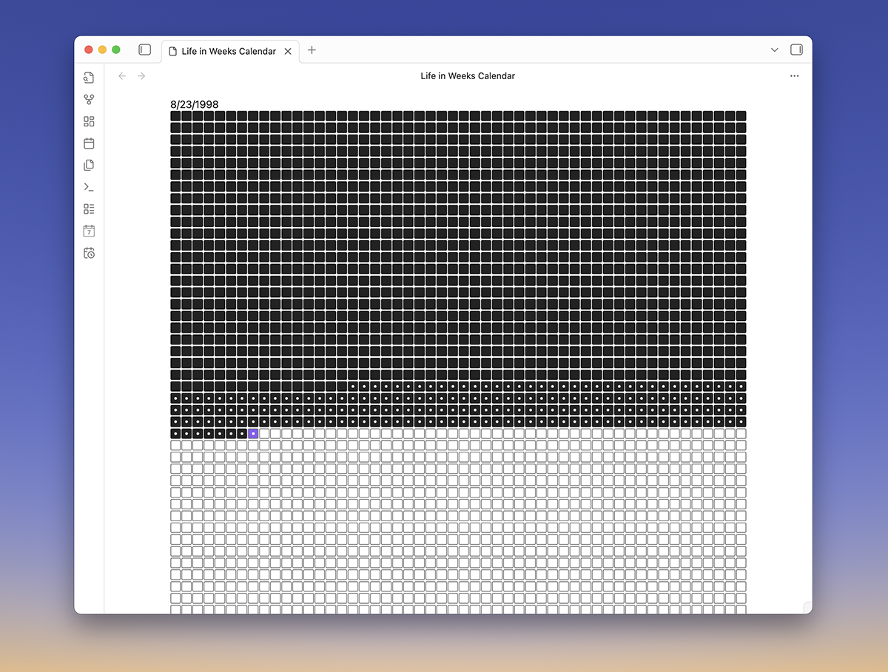
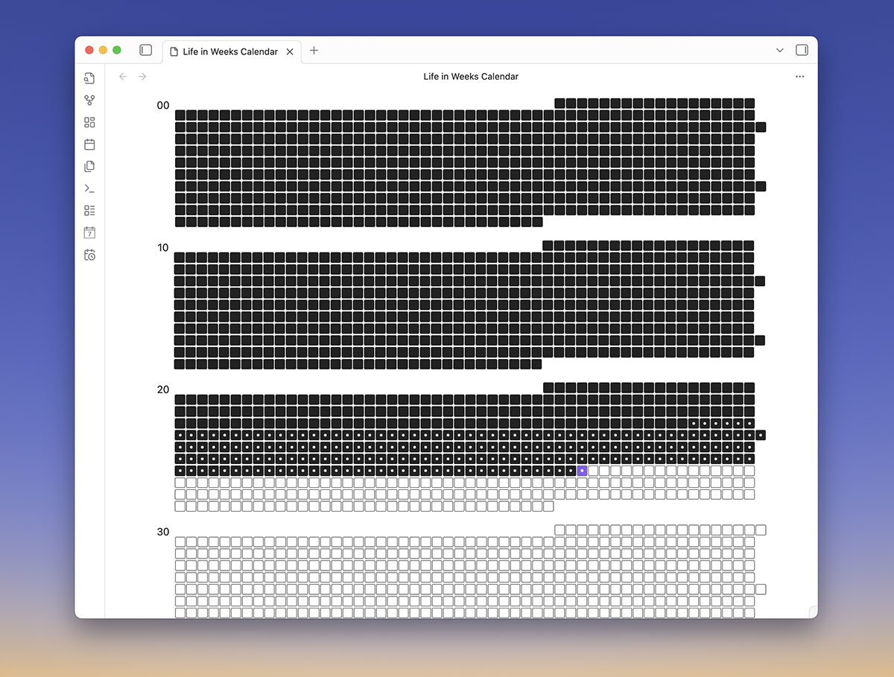

# Obsidian Life in Weeks Calendar Plugin

## The Life in Weeks Concept

The _Life in Weeks Calendar_ is a visual tool designed to shift one's perspective on time and mortality. It presents a stark, tangible representation of a human lifespan, typically around 90 years, broken down into individual weeks, each represented by a small box. This grid of approximately 4,680 boxes serves as a powerful reminder of the finite nature of life.

At its heart, the life in weeks calendar is a "memento mori," a Latin phrase meaning "remember that you must die." This concept, with roots in Stoic philosophy, encourages individuals to live more intentionally by keeping their mortality at the forefront of their minds. The calendar is not meant to be a morbid or anxiety-inducing tool, but rather a catalyst for positive change.

## Periodic Notes plugin integration

While not required, this plugin's integrates with and is improved by installing the Periodic Notes plugin and activating the weekly notes feature. Weeks can display an indicator on weeks where you've created a weekly note. If you have the standard Calendar plugin installed, Life in Weeks will sync with your selected week start day.

## Plugin Settings and Options

**Birthdate:**  
Enter your birthday.

**Lifespan:**  
Enter the numbers of years you expect to live.

**Calendar Mode:**  
Choose how you'd like the calendar displayed, either "Basic" or "Yearly" (more details on each of these below).

**View Location:**  
Sets which panel a new calendar will be opened in when you use the "Open Life in Weeks Calendar" ribbon button or command pallet option.

**Weekly note integration:**  
If you have Periodic Notes installed and the weekly notes feature enabled, Life in Weeks will integrate with your weekly notes. Weeks with corresponding weekly notes will be indicated with a dot. Clicking on a week will open that week's weekly note if it exists, or create a new one if it does not.

## Calendar Modes

### Basic View

Displays your life in a grid with each cell representing a week in your life. Each week you've been alive is filled in. Each row is fifty weeks long representing a year in your life. This view mode is responsive and collapses to shorted row lengths in smaller screens or sidebar panels. This is the traditional view for a life in weeks style calendar.

### Yearly View

This view corrects an over simplification in the basic view. Years actually have fifty-two weeks and one day in a year, and depending on the year, will have either fifty-two or fifty-three week start dates. This view accounts for these variations and corrects varying year lengths. Each row accurately reflects a year, and decades of your life are grouped for easier visual parsing. Because row lengths are strictly accurate, this view is not responsive and is only practical for use in the main Obsidian view area.

## Credits

Built on functionality from [Periodic Notes](https://github.com/liamcain/obsidian-periodic-notes), [Calendar](https://github.com/liamcain/obsidian-calendar-plugin/tree/master), and [obsidian-daily-notes-interface](https://github.com/liamcain/obsidian-daily-notes-interface).

## Thank You 🙏

If you like this plugin, a coffee is always appreciated!

