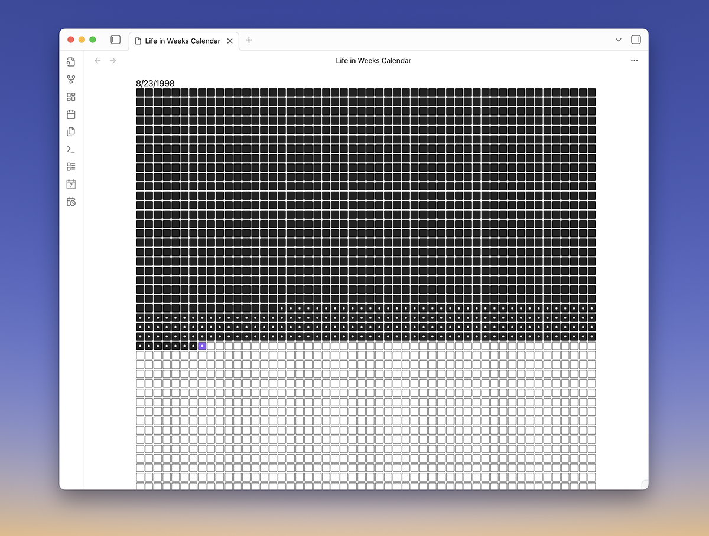
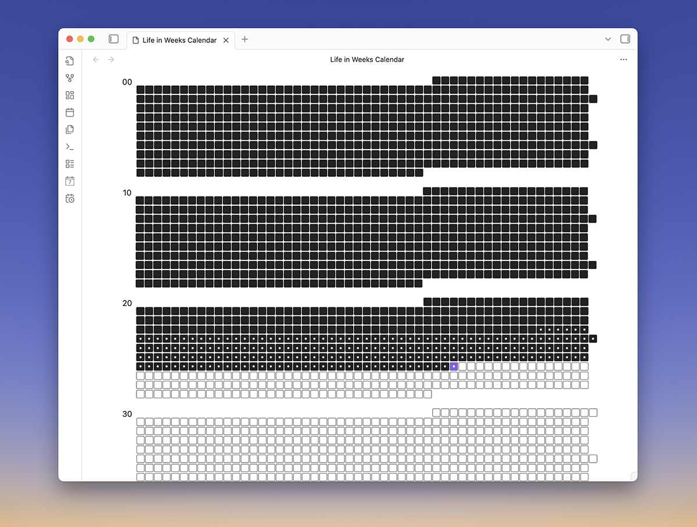

# Life in Weeks Calendar for Obsidian

## Overview

This plugin displays your entire life in a grid of weeks. It color-codes past, present, and future weeks and, more importantly, marks the weeks when you have created a weekly Obsidian note. Use it as a standalone weekly journaling system, or to extend the functionality of either the Periodic Notes plugin or the Journals plugin.

## The Life in Weeks Concept

The _Life in Weeks Calendar_ is a visual tool designed to shift one's perspective on time and mortality. It presents a stark, tangible representation of a human lifespan, typically around 90 years, broken down into individual weeks, each represented by a small box. This grid of approximately 4,680 boxes serves as a powerful reminder of the finite nature of life.

At its heart, the life in weeks calendar is a "memento mori," a Latin phrase meaning "remember that you must die." This concept, with roots in Stoic philosophy, encourages individuals to live more intentionally by keeping their mortality at the forefront of their minds. The calendar is not meant to be a morbid or anxiety-inducing tool, but rather a catalyst for positive change.

## Plugin Settings and Options

**Birth Date:**  
Enter your birthday.

**Projected Lifespan:**  
Enter the numbers of years you expect to live.

**Calendar View Mode:**  
Choose how you'd like the calendar displayed, either "Standard" or "Decades" (more details on each of these below).

**View Location:**
Sets which panel a new calendar will be opened in when you use the "Open Life in Weeks Calendar" ribbon button or command palette option.

**Weekly note folder location**

Set the folder where your weekly notes will be stored. Select from existing folders.

- You can create sub-folders within your weekly notes folder using date-based variables in the form of `{{date:format}}`
- Example: Setting your folder as `weekly-notes/{{date:YYYY}}` will organize your notes into yearly sub-folders

**Important performance consideration:** It is strongly recommended to keep your weekly notes in a statically named subfolder rather than directly in your vault root or in a series of dynamically named folders. This improves scanning performance and reduces the number of files the plugin needs to check.

- ❌ Don't use:
    - `/` - The vault root as your weekly note folder
    - `{{date:YYYY}}` - Parallel dynamic folders at the root level
- ✓ Do use:
    - `weekly-notes` - A dedicated folder
    - `weekly-notes/{{date:YYYY}}` - A dedicated folder with parallel sub-folders

**Weekly note file naming pattern**

Weekly note filenames must resolve to uniquely identifiable weeks (e.g., contain the year and the week number, or contain the year, month, and week start day).

Use [Moment.js date formatting](https://momentjs.com/docs/#/parsing/string-format/) patterns for file names. Common patterns include:

- `gggg-[W]ww` - Year and week number (e.g., `2025-W12`)
- `YYYY-MM-DD` - Year, month, and first date of the week (e.g., `2025-02-28`)
- `DD-MM-YYYY` - First date of the week, month, and year (e.g., `28-02-2025`)

You can also use variable naming format in conjunction with proper moment.js syntax:

- Example: `year-{{date:YYYY}}-week-{{date:ww}}` will resolve to `year-2025-week-23.md`

**First day of the week**
Set the first day of the week. Defaults to Monday.

**Weekly note template**
Choose a file to use as a template for your new weekly notes. Newly created notes will be prefilled with content from this file.

### Integrations

This is a fully-functioning, standalone journaling plugin — no additional plugins required. If you are coming from an existing journal system and simply want to explore a novel visualization method while staying within your platform, support for two third-party calendar note systems is provided:

**Periodic Notes Integration:**  
Optionally, this plugin can integrate with the [Periodic Notes](https://github.com/liamcain/obsidian-periodic-notes) plugin. With the Periodic Notes plugin installed and the weekly note feature enabled, settings for the folder path, file naming convention, and note templates will come from the Periodic Notes' settings. If you have the standard Calendar plugin installed, Life in Weeks will sync with your selected week start day.

Note: If you're using the Periodic Notes settings integration and you change settings in the Periodic Notes plugin, you will have to close and reopen your Life in Weeks Calendar to see those changes reflected.

**Journals Plugin Integration:**  
Optionally, this plugin can integrate with the [Journals](https://github.com/srg-kostyrko/obsidian-journal) plugin. With the Journals plugin installed and the weekly note feature enabled, settings for the folder path, file naming convention, note templates, and first day of the week will come from the Journals' settings.

Note: If you're using the Journals settings integration and you change settings in the Journals plugin, you will have to close and reopen your Life in Weeks Calendar to see those changes reflected.

## Template Variables

When creating weekly notes from templates, the plugin automatically replaces special variables with contextual values. This feature is compatible with Obsidian's core Templates plugin syntax.

### Supported Variables

- **`{{date}}`** - The week's start date in `YYYY-MM-DD` format (e.g., `2024-03-10`)
- **`{{date:FORMAT}}`** - The week's start date with a custom [Moment.js format](https://momentjs.com/docs/#/displaying/format/) (e.g., `{{date:MMMM Do, YYYY}}` becomes `March 10th, 2024`)
- **`{{time}}`** - The current time in `HH:mm` format (e.g., `14:30`)
- **`{{time:FORMAT}}`** - The current time with a custom [Moment.js format](https://momentjs.com/docs/#/displaying/format/) (e.g., `{{time:h:mm A}}` becomes `2:30 PM`)
- **`{{title}}`** - The filename without the `.md` extension (e.g., if the file is `2024-W11.md`, `{{title}}` becomes `2024-W11`)
- **`{{WEEKDAY:FORMAT}}`** - The date of a weekday in a the note's week. Format is required. Example: `{{monday:dddd YYYY-MM-DD}}` might become `Monday 2025-12-08`

## Templater

Alternatively, you can use the [Templater](https://github.com/SilentVoid13/Templater) plugin to automatically generate note data. You will want to make date values in the Templater templates be relative to the note's week rather than the current date. Example, to get the Monday of a given week's note, use `<% tp.date.weekday("dddd YYYY-MM-DD", 0, tp.file.title, "YYYY-[W]WW") %>` which also becomes `Monday 2025-12-08` in a note titled `2025-W49`.

### Important Notes

- Date and time variables use the **week's start date** (based on your configured week start day), not the current date
- This allows weekly notes to reflect the actual week they represent
- Variables support whitespace (e.g., `{{ date }}` works the same as `{{date}}`)
- Custom formats use [Moment.js formatting tokens](https://momentjs.com/docs/#/displaying/format/)

## Calendar Modes

### Standard View

Displays your life in a grid with each cell representing a week in your life. Each week you've been alive is filled in. Each row is fifty weeks long representing a year in your life. This view mode is responsive and collapses to shorter row lengths in smaller screens or sidebar panels. This is the traditional view for a life in weeks style calendar.

### Decades View

This view corrects an over simplification in the basic view. Years actually have fifty-two weeks and one day, and depending on the year, will have either fifty-two or fifty-three week start dates. This view accounts for these variations and corrects varying year lengths. Each row accurately reflects a year, and decades of your life are grouped for easier visual parsing. Because row lengths are strictly accurate, this view is not responsive and is only practical for use in the main Obsidian view area.
